<!-- readme.forge dashboard grid · GitHub mobile linearizes <table> layouts: modules stack top-to-bottom on phones (intended) -->
<table border="0" cellspacing="8" cellpadding="0" width="100%">
  <tr>
    <td colspan="2" align="center"></td>
  </tr>
  <tr>
    <td colspan="2" align="center"></td>
  </tr>
  <tr>
    <td colspan="2" align="center"></td>
  </tr>
  <tr>
    <td colspan="2" align="center"></td>
  </tr>
  <tr>
    <td colspan="2" align="center"></td>
  </tr>
</table>

  

<!--  -->
